# Portfolio Optimization with the Mean Absolute Deviation (MAD) Model

> Project work in Applied Mathematics (DTU, course 01666), Group 6.2 by Dániel László Seregi, Taim Kamal Brik and Victor Kragballe. This study implements the **Mean Absolute Deviation (MAD)** portfolio model — a linear-programming alternative to Markowitz mean–variance — and tests whether **adaptive rebalancing** (rolling and expanding estimation windows) improves out-of-sample performance over a static portfolio, under realistic allocation caps and transaction costs, on a universe of 20 US ETFs.

## 1. Background and motivation

Every investor faces the same fundamental problem: markets are uncertain, asset returns fluctuate unpredictably, and choosing a portfolio by intuition tends to produce unnecessarily risky outcomes. Portfolio optimization gives a disciplined way to balance risk and return, quantify diversification, and build allocations that hold up across market regimes.

The classical approach is the Markowitz mean–variance model, which measures risk through the variance of returns and is solved as a quadratic program (QP). Its defining object is the covariance matrix, where each entry measures how two assets co-move — the mathematical basis for diversification. As Markowitz famously put it, diversification is the only free lunch in investing [^wiki]. But variance has two practical drawbacks: it requires estimating a noise-sensitive covariance matrix, and QP solvers scale roughly cubically with the number of assets.

The **MAD model** replaces variance with the average *absolute* deviation of portfolio returns from their mean [^book]. This keeps the entire problem **linear** (an LP), so it solves faster and scales almost linearly with problem size. Crucially, MAD is **scenario-based**: historical monthly returns are treated as discrete equally likely outcomes, so dependence between assets is captured directly through the empirical return distribution rather than through an estimated covariance matrix.

The research question driving this repository:

> **Can adaptive rebalancing strategies (rolling and expanding estimation windows) improve out-of-sample performance relative to a static MAD portfolio, and which adaptive framework most reliably delivers superior risk-adjusted performance?**

The headline answer: **no single adaptive framework dominates.** The rolling model delivers the best risk-adjusted return (highest Sharpe), the expanding model delivers the highest total return, and the static model is consistently the weakest of the three. Which one to prefer depends entirely on the investor's objective.

## 2. The MAD model

MAD minimizes the probability-weighted average absolute deviation of portfolio returns from their expected value. With each of the `T` historical months treated as an equally likely scenario (`p_t = 1/T`), the absolute value is linearized using auxiliary deviation variables `d_t`, giving a clean linear program:

```
minimize   Σ_t  p_t · d_t
subject to d_t ≥  (y_t − μ)          for all scenarios t      (upper deviation)
           d_t ≥ −(y_t − μ)          for all scenarios t      (lower deviation)
           y_t = Σ_j r_jt · x_j      for all scenarios t      (scenario return)
           μ   = Σ_j μ_j · x_j                                 (expected portfolio return)
           μ   ≥ μ₀                                            (minimum required return)
           Σ_j x_j = 1                                         (fully invested)
           x_j ≥ 0                  for all assets j           (no short selling)
```

Here `x_j` are the portfolio weights, `r_jt` is the realized return of asset `j` in month `t`, `μ_j` is the expected return of asset `j`, and `μ₀` is the investor's minimum target return. At the optimum the solver pushes each `d_t` as small as possible, so the two deviation constraints together enforce `d_t = |y_t − μ|`.

### Extensions

Two "real-world" features are layered on top of the base model to make it deployable:

**Allocation cap.** A single constraint `x_j ≤ w_max` (default 25%) prevents the optimizer from concentrating everything in one asset. Without it, a small asset set often collapses to a single holding — e.g. on `[SPY, SCHG, VUG, MGK]` with `μ₀ = 1%` the model puts 100% in SPY. The cap forces diversification across at least `1/w_max` assets (≥4 at 25%).

**Proportional transaction costs.** Each rebalance incurs a cost proportional to the traded amount. With buy/sell variables `b_j, s_j ≥ 0` satisfying `x_j − x_jᵒˡᵈ = b_j − s_j`, the cost `Σ_j c_j (b_j + s_j)` is subtracted inside the return constraint. A flat rate `c_j = 0.15%` is used throughout [^natixis][^schwab]. Costs apply only to the adaptive (rebalancing) models — the static model never trades after the initial purchase.

## 3. Data

Historical monthly returns for **20 US ETFs** are downloaded from Yahoo Finance [^yahoo] via the `yfinance` package [^yfinance]. ETFs are chosen over single stocks because each one provides broad exposure across a sector or asset class, which makes them well-suited to studying diversification. The universe was selected for **maturity** (all funds >10 years old) and **sector diversification** (distinct underlying market drivers), and restricted to American funds to isolate returns from foreign-exchange noise.

| ETF  | Sector | Annual return | Age (yrs) | | ETF  | Sector | Annual return | Age (yrs) |
|------|--------|--------------:|----------:|-|------|--------|--------------:|----------:|
| SPY  | Top 500 US companies        | 10.59% | 33 | | XLK  | S&P tech companies       | 9.51%  | 27 |
| SCHG | US large growth             | 15.65% | 16 | | AIRR | Industrials & reg. banks | 16.57% | 12 |
| VUG  | Vanguard large growth       | 11.73% | 22 | | VGT  | Vanguard US tech         | 13.93% | 22 |
| MGK  | Largest US growth           | 12.96% | 18 | | SOXX | US semiconductor index   | 12.66% | 24 |
| XLY  | US consumer discretionary   | 9.56%  | 27 | | GLD  | Gold                     | 11.35% | 21 |
| IYW  | US technology               | 8.49%  | 25 | | XAR  | US aerospace & defense   | 19.20% | 14 |
| PSI  | US semiconductors           | 16.51% | 20 | | VPU  | US utilities             | 10.12% | 22 |
| FDN  | US internet                 | 13.39% | 19 | | XLV  | US healthcare            | 8.37%  | 27 |
| IGM  | US tech & media             | 11.73% | 25 | | PHO  | US water infrastructure  | 8.31%  | 20 |
| FTEC | Fidelity US tech            | 20.22% | 12 | | ARKW | Internet / innovation    | 19.42% | 11 |

**Scenario matrix.** Monthly returns are computed from adjusted closing prices (adjusted for splits, dividends and other corporate actions) and arranged into a matrix `R ∈ ℝ^{n×T}`, one row per ETF, one column per month. The common start date is bounded by **ARKW** (incepted Sep 2014 [^arkw]), the youngest fund. After dropping months with any missing values, the final matrix spans **October 2014 – December 2025**, giving **T = 135** monthly observations.

**Train/test split.** A 60/40 split gives **81 training months** (Oct 2014 – Jun 2021) and **54 test months** (Jul 2021 – Dec 2025). Models are estimated only on data available before each test month; the test data is used purely for out-of-sample evaluation.

## 4. Exploratory data analysis

<p align="center">
  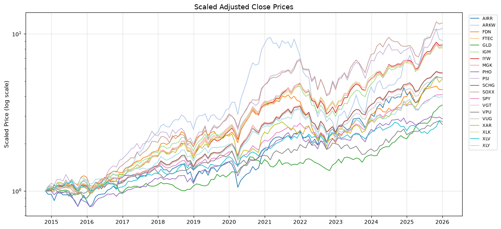
</p>

*Figure 1. Cumulative scaled adjusted-close prices, normalized to 1 at the start of Oct 2014 (log scale).* There is large dispersion in long-run performance: growth-oriented tech ETFs (FTEC, SCHG, ARKW) substantially outperform defensive sectors like VPU (utilities) and XLV (healthcare). The COVID-19 drawdown in early 2020 shows up as a sharp synchronized drop across all funds, followed by a rapid recovery and then the broad 2022 decline.

<p align="center">
  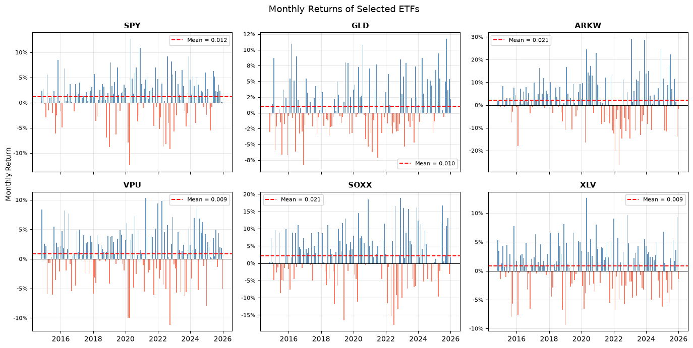
</p>

*Figure 2. Monthly returns for six representative ETFs (blue = positive, red = negative; dashed line = sample mean).* The March 2020 COVID shock is the largest single negative month across nearly all funds, with the April–May 2020 recovery producing the largest positives. GLD (gold) shows noticeably lower variability — a natural risk-reducing component — while ARKW swings widest in both directions.

<p align="center">
  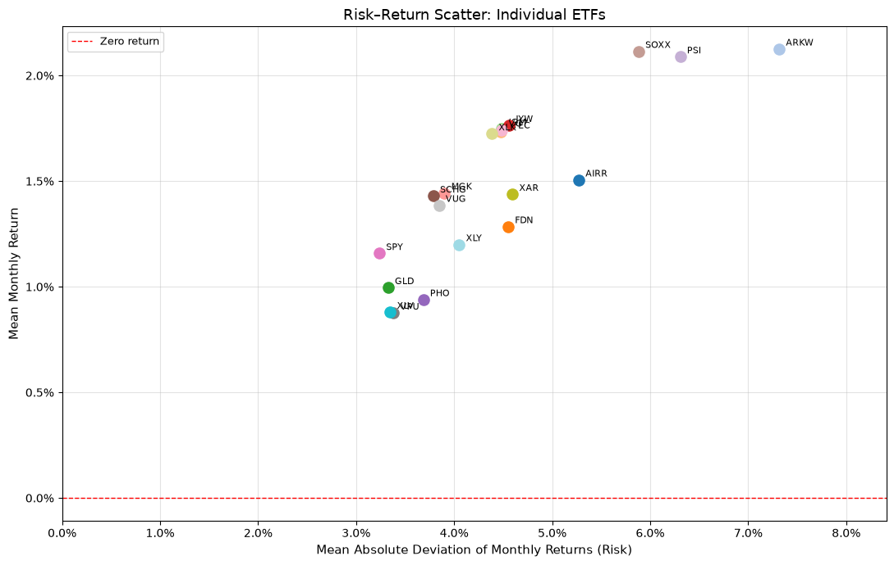
</p>

*Figure 3. Risk–return scatter of individual ETFs (x = mean absolute deviation, y = mean monthly return).* The upper-left is desirable (high return, low risk). SPY sits at the low-risk/modest-return end; SOXX, PSI and ARKW occupy the high-return/high-risk corner. No single ETF dominates in both dimensions — which is exactly the motivation for combining them.

<p align="center">
  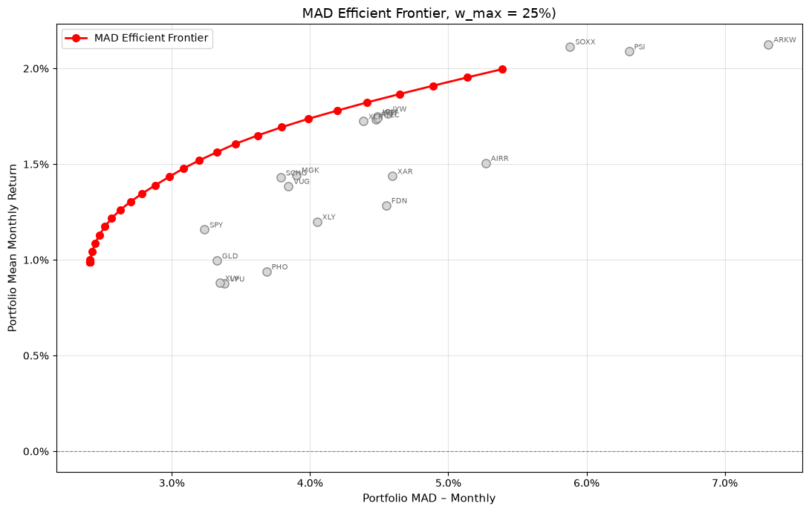
</p>

*Figure 4. MAD efficient frontier (training period, 25% allocation cap).* Each red dot is an optimal portfolio for a given required return `μ₀`; grey markers are the individual ETFs. The frontier lies to the **left** of every individual ETF, confirming that diversification reduces risk at all return levels. It flattens at the top because maximum return is bounded by the highest-return assets.

## 5. Strategies compared

| Strategy | How it estimates | Rebalances? | Key parameter |
|---|---|:---:|---|
| **Non-adaptive** | Solved once on the training window; weights held fixed for the whole test period | No | — |
| **Rolling window** | Re-solved each test month using only the most recent `L` months | Yes | `L = 10` |
| **Expanding window** | Re-solved each test month using *all* past data, with exponential forgetting `λ` weighting recent months more | Yes | `λ = 0.97` |
| **SPY** | 100% SPY, passive benchmark | No | — |

Exponential forgetting in the expanding model sets scenario probabilities `p_t ∝ λ^(T−t)`, so recent observations carry more weight (`λ = 1` recovers equal weighting). Both adaptive models carry the previous month's portfolio forward as `xᵒˡᵈ` so transaction costs reflect actual trading, and fall back to the previous portfolio if a monthly problem is infeasible.

## 6. Performance metrics

- **Sharpe ratio** [^sharpe] — average return per unit of volatility (risk-free rate set to 0); the primary measure. Higher is better.
- **Average monthly return** and **total return** — profitability over the test period.
- **Realized MAD** — out-of-sample average absolute deviation of returns; lower means a more stable portfolio.
- **MAD error** — gap between the model's estimated risk and realized risk; measures how well the model predicts its own risk.
- **HHI** (Herfindahl–Hirschman Index) [^hhi] — `Σ x_j²`; concentration, ranging from `1/n` (perfectly diversified) to `1` (single asset). An HHI near 0.25 corresponds roughly to four assets held at the cap.

## 7. Results

All models below use `μ₀ = 1.9%/month`, `L = 10`, `λ = 0.97`, transaction cost 0.15%, and a 25% allocation cap. All optimization problems are solved with **Gurobi** [^gurobi].

| Model | Avg. return | Realized MAD | **Sharpe** | Model MAD | MAD error | HHI | Cost | **Total return** |
|---|---:|---:|---:|---:|---:|---:|---:|---:|
| Non-adaptive | 1.144% | 5.240% | 0.178 | 3.130% | −2.110% | 0.201 | — | 65.91% |
| **Rolling (L=10)** | 1.396% | 3.869% | **0.286** | 3.171% | −0.698% | 0.201 | 3.176% | 98.62% |
| **Expanding (λ=0.97)** | 1.500% | 4.933% | 0.239 | 4.314% | −0.619% | 0.207 | 1.064% | **101.68%** |
| SPY | 1.084% | 3.698% | 0.239 | — | — | 1.000 | — | 69.55% |

*Table 1. Out-of-sample performance over the 54-month test period.*

**Key takeaways:**

- The **rolling** model wins on **risk-adjusted return** (Sharpe 0.286 vs 0.178 static), cutting realized MAD from 5.24% to 3.87% while raising average return — it adapts fastest to changing conditions.
- The **expanding** model wins on **total wealth** (101.68%) but takes more realized risk, landing its Sharpe roughly level with SPY.
- Both adaptive models predict their own risk far more accurately than the static model (much smaller MAD error).
- The rolling model trades more aggressively (3.18% cumulative cost vs 1.06% for expanding), but faster adaptation still pays off in Sharpe terms.

<p align="center">
  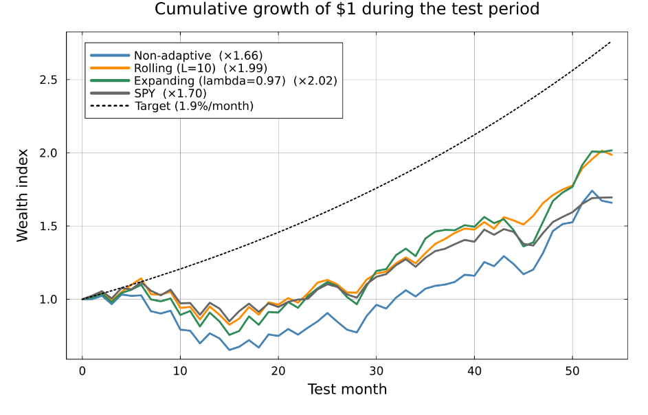
</p>

*Figure 5. Cumulative growth of \$1 over the test period.* Both adaptive models recover more strongly and finish above the static model and SPY. The expanding model ends highest, with the rolling model close behind. The dotted target line (`μ₀ = 1.9%/month`) grows faster than every realized strategy — the in-sample target is ambitious relative to realized out-of-sample performance.

<p align="center">
  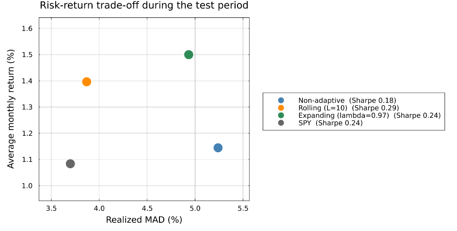
</p>

<p align="center">
  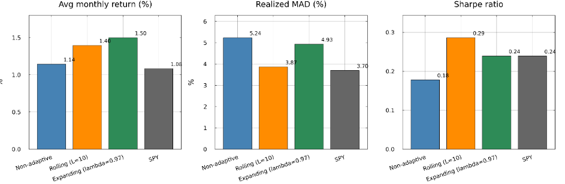
</p>

*Figure 6. Risk–return trade-off (top) and headline metrics (bottom).* The rolling model gives the most attractive trade-off among the MAD strategies — higher return at low realized MAD. The expanding model gives the highest return but sits further right (higher risk). The bar charts confirm: rolling has the strongest Sharpe, expanding the highest average return, static the weakest overall.

<p align="center">
  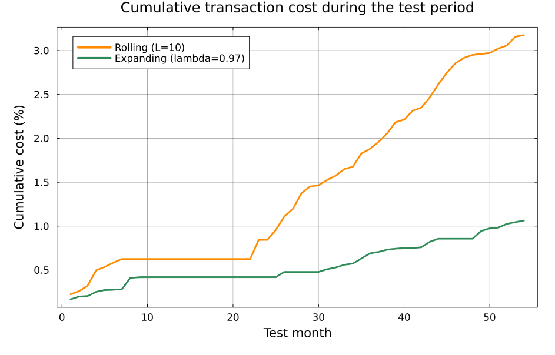
  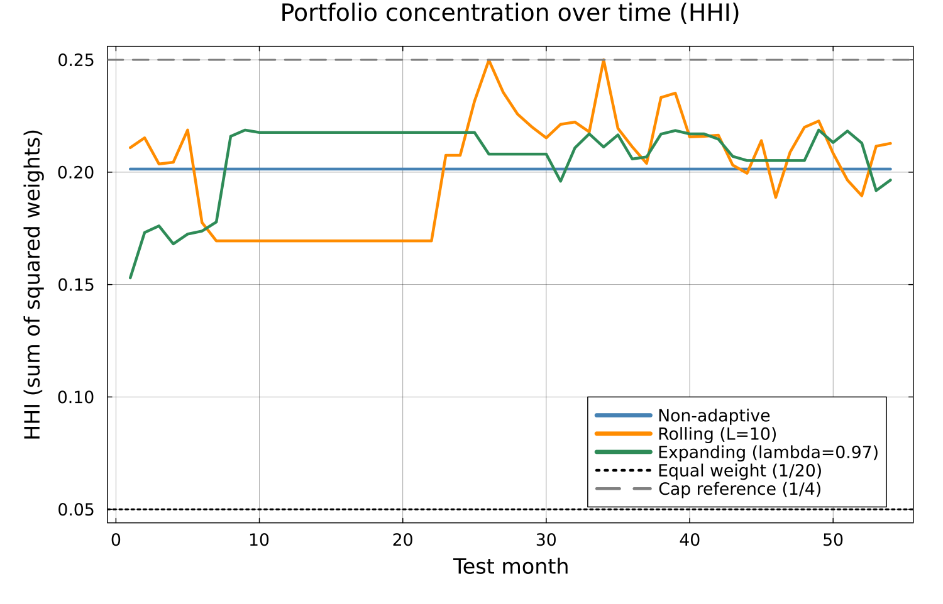
</p>

*Figure 7. Cumulative transaction costs (left) and portfolio concentration via HHI (right).* The rolling model trades more because it reacts to only the last 10 months; the expanding model's longer memory makes it more stable. HHI hovers near 0.20 for all strategies — fairly concentrated, often close to the structure implied by the 25% cap.

<p align="center">
  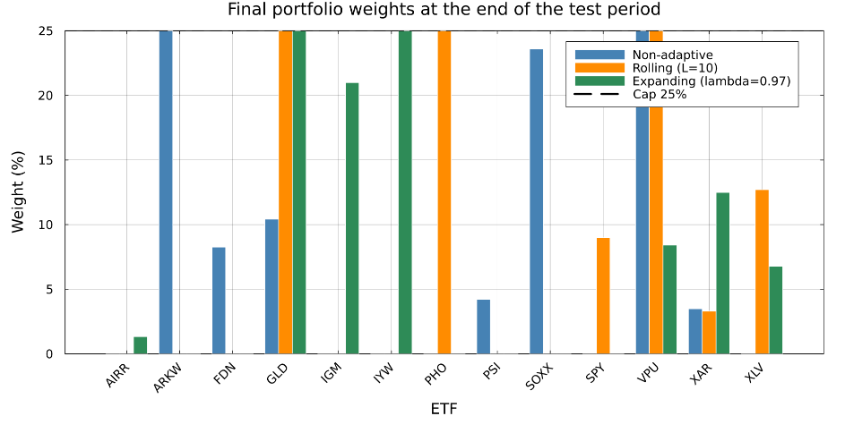
</p>

*Figure 8. Final portfolio weights.* Several weights sit at or near the 25% cap, showing the allocation maximum is active and shapes the final composition — confirming the cap is doing real work in preventing over-concentration.

## 8. Sensitivity analysis

The conclusions are stress-tested against four parameters to check they aren't artifacts of a single arbitrary choice.

### Rolling-window length `L`

| L | Avg. return | MAD | Sharpe | HHI | Cost | Total return |
|---|---:|---:|---:|---:|---:|---:|
| 3  | 0.537% | 3.754% | 0.113 | 0.226 | 5.991% | 25.68% |
| 6  | 1.105% | 3.646% | 0.242 | 0.214 | 3.846% | 71.33% |
| **10** | 1.396% | 3.869% | **0.286** | 0.201 | 3.176% | 98.62% |
| 12 | 1.201% | 3.758% | 0.250 | 0.206 | 2.327% | 79.24% |
| 18 | 1.283% | 3.649% | 0.282 | 0.201 | 1.972% | 88.50% |
| **24** | 1.493% | 4.044% | **0.292** | 0.210 | 1.666% | 108.01% |
| 36 | 1.186% | 4.846% | 0.196 | 0.211 | 1.411% | 71.74% |
| 48 | 1.472% | 5.279% | 0.219 | 0.206 | 1.070% | 95.71% |
| 60 | 1.291% | 4.886% | 0.210 | 0.199 | 0.989% | 81.10% |

Very short windows are noisy and perform poorly (`L=3` → Sharpe 0.113). Performance peaks at a **moderate** length — `L=24` is best (Sharpe 0.292) with `L=10` close behind — while long windows raise realized MAD and erode Sharpe. The lesson: short enough to adapt, long enough to avoid noise.

<p align="center">
  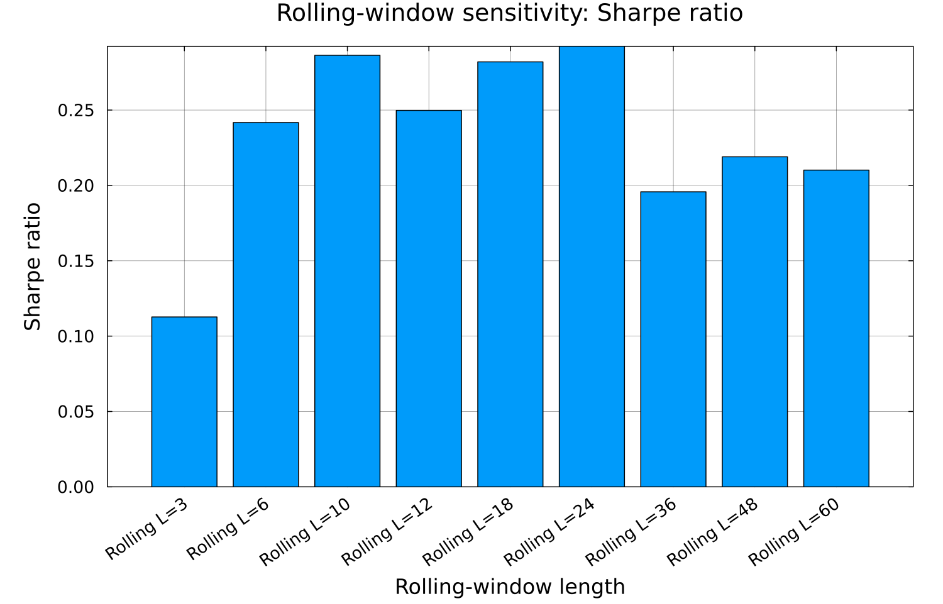
  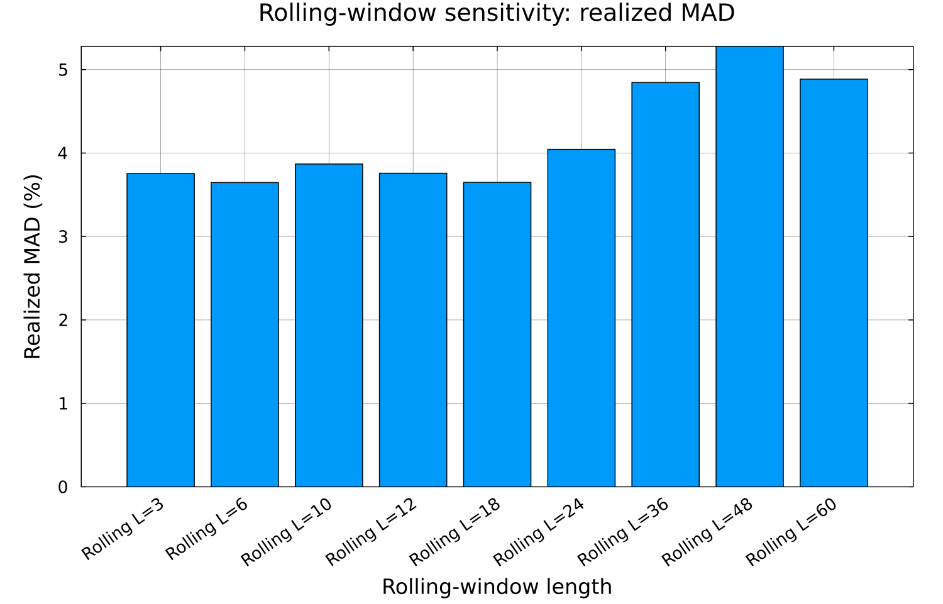
</p>

### Forgetting factor `λ`

| λ | Avg. return | MAD | Sharpe | HHI | Cost | Total return |
|---|---:|---:|---:|---:|---:|---:|
| 0.50 | 0.909% | 3.650% | 0.202 | 0.220 | 4.364% | 54.54% |
| 0.70 | 0.811% | 3.710% | 0.172 | 0.209 | 3.889% | 45.82% |
| 0.85 | 1.193% | 3.992% | 0.235 | 0.207 | 2.971% | 77.17% |
| 0.90 | 1.305% | 3.992% | 0.256 | 0.206 | 2.428% | 88.07% |
| **0.95** | 1.635% | 4.764% | **0.267** | 0.210 | 1.466% | 117.60% |
| 0.97 | 1.500% | 4.933% | 0.239 | 0.207 | 1.064% | 101.68% |
| 0.98 | 1.488% | 5.402% | 0.219 | 0.209 | 0.903% | 96.92% |
| 0.99 | 1.212% | 5.523% | 0.175 | 0.203 | 0.602% | 69.08% |
| 1.00 | 1.025% | 5.954% | 0.137 | 0.210 | 0.539% | 49.89% |

Some forgetting helps. The best result is around **`λ ≈ 0.95`** (Sharpe 0.267). Too low (≤0.70) makes the model over-reactive and costly; too high (≥0.99, approaching no forgetting) makes it too slow to adapt, raising realized MAD and cutting Sharpe.

<p align="center">
  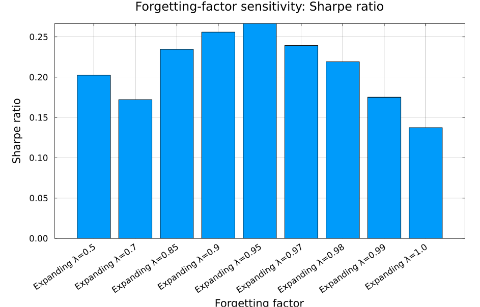
  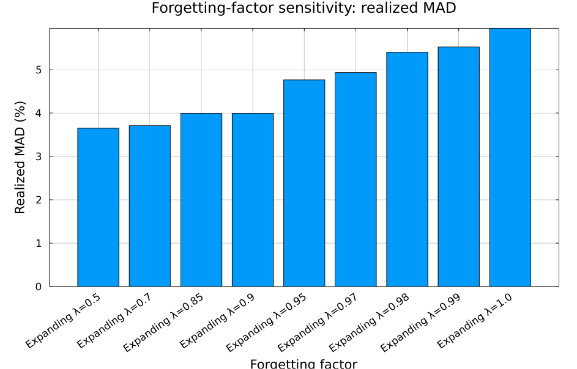
</p>

### Allocation cap `w_max`

Tested over `{5%, 7.5%, 10%, 15%, 20%, 25%, 35%, 50%, 100%}`. At `w_max = 5%` both models are forced to equal weight (HHI 0.05, identical results). As the cap relaxes, concentration rises. For the **rolling** model the best Sharpe occurs around `20–25%` (≈0.288); relaxing further only increases concentration and reduces total return. For the **expanding** model a looser cap mainly lets it chase higher — but riskier and more concentrated — returns, peaking at 126.17% total return with `w_max=100%` (HHI 0.363, realized MAD 5.15%). The **25% cap is a sensible compromise**: enough flexibility to improve performance while still limiting concentration.

<p align="center">
  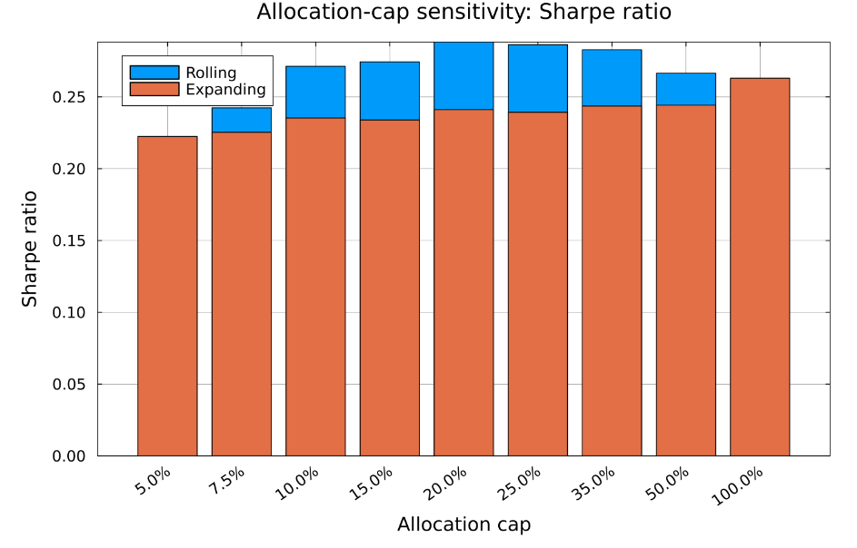
</p>

### Required monthly return `μ₀`

Swept from 0% to 5% in 0.1-point steps. Selected results:

| Model | μ₀ | Avg. return | Realized MAD | Sharpe | Total return |
|---|---:|---:|---:|---:|---:|
| Non-adaptive | 0.0% | 1.145% | 3.038% | **0.317** | 78.72% |
| Non-adaptive | 1.9% | 1.144% | 5.240% | 0.178 | 65.91% |
| Rolling | 1.9% | 1.396% | 3.869% | 0.286 | 98.62% |
| **Rolling** | **2.0%** | 1.505% | 3.896% | **0.308** | 110.41% |
| Rolling | 3.1% | 1.547% | 4.141% | 0.297 | 113.46% |
| **Expanding** | **1.6%** | 1.511% | 4.069% | **0.296** | 110.06% |
| Expanding | 1.9% | 1.500% | 4.933% | 0.239 | 101.68% |

When `μ₀ = 0` the return constraint is non-binding and the models simply minimize risk — here the **static** model actually wins (Sharpe 0.317), which is consistent with the MAD model's purpose only really mattering once a positive target is set. Once a realistic target is imposed (≈1.6%–2.0%), the **adaptive models pull ahead** because they can update as new data arrives. The rolling model peaks near `μ₀ = 2.0%`, the expanding model near `μ₀ = 1.6%`.

<p align="center">
  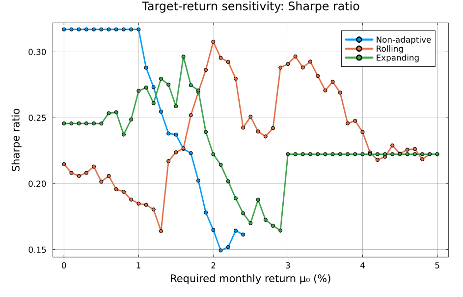
  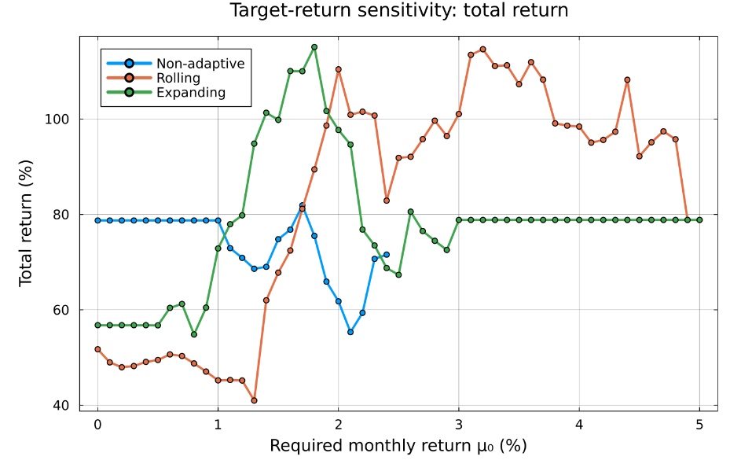
  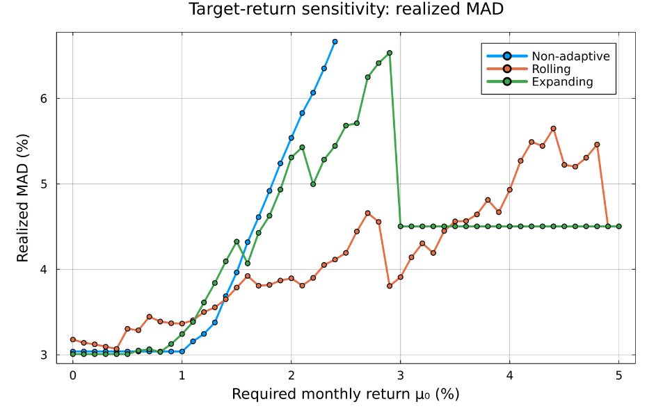
</p>

*Figure 9. Sensitivity of Sharpe, total return and realized MAD to the required monthly return `μ₀`.* Flat segments in the high-`μ₀` region of the adaptive curves reflect months where the problem was infeasible and the previous portfolio was carried forward.

## 9. Discussion

Adaptive rebalancing was introduced to address a clear limitation of the standard MAD model: in the static formulation, weights are fixed once on historical data, implicitly assuming market conditions stay stable — which they rarely do. Re-estimating over time lets the model absorb new information.

The rolling and expanding approaches represent two ways of using history. The rolling model focuses on recent observations and adapts quickly, which improves risk-adjusted performance (higher Sharpe). The expanding model uses a larger information set, producing more stable estimates, higher total returns, but also higher realized risk. The allocation cap and transaction costs make the comparison realistic: without a cap the optimizer concentrates heavily, and ignoring trading costs would overstate the value of frequent rebalancing.

Importantly, the sensitivity analyses show adaptive strategies do **not** automatically beat the static model — performance depends strongly on `L`, `λ`, `w_max` and `μ₀`. Moderate parameter values generally win; overly aggressive settings raise risk and destabilize the portfolio.

## 10. Conclusion

Adaptive MAD models can meaningfully improve on a static MAD portfolio **when a positive return target is imposed** — but no single framework dominates across all criteria. The preferred strategy depends solely on the investor's objective:

- **Best risk-adjusted performance** → rolling window
- **Highest total return** → expanding window
- **Lowest realized risk** → the passive SPY benchmark

The other key finding is that adaptive MAD optimization delivers strong performance **only when supported by careful parameter selection and realistic modeling assumptions** (caps, costs, sensible windows).

## 11. Repository layout and how to run

```
data/                          monthly_ROR_{train,test,full}.csv, mad_weights.csv
figures/                       result images referenced above
python/
  clean_returns_data_yf.ipynb  download + clean data, 60/40 split, export CSVs
  visualization.ipynb          scaled prices, return distributions, frontier, summaries
julia/
  MAD_solve.jl                 core MAD LP (simple + rebalancing with transaction costs)
  run_MAD_simple.jl            solve simple MAD, evaluate out-of-sample
  run_non_adaptive.jl          static strategy
  run_rolling_adaptive.jl      rolling-window strategy
  run_expanding_adaptive.jl    expanding-window strategy (exponential forgetting)
  main_comparison.jl           run all three + SPY, produce comparison figures
  sensitivity_common.jl        shared helpers for the sensitivity drivers
  driver_test_L.jl             sensitivity: rolling-window length
  driver_test_lambda.jl        sensitivity: forgetting factor
  driver_test_mubar.jl         sensitivity: required return
  driver_test_wmax.jl          sensitivity: allocation cap
```

**1. Generate the data (Python)**

```bash
pip install yfinance pandas numpy matplotlib scipy
# run python/clean_returns_data_yf.ipynb -> writes data/monthly_ROR_{train,test,full}.csv
```

**2. Run the optimization (Julia)**

```bash
# requires a Gurobi license + Gurobi.jl, plus JuMP, CSV, DataFrames, Statistics, Plots
julia julia/main_comparison.jl      # main 3-way comparison + SPY benchmark
julia julia/driver_test_L.jl        # sensitivity sweeps
julia julia/driver_test_lambda.jl
julia julia/driver_test_mubar.jl
julia julia/driver_test_wmax.jl
```

> Gurobi can be swapped for the open-source **Cbc** solver in `MAD_solve.jl` (the import and `Model(Cbc.Optimizer)` lines are already present, commented out) if a Gurobi license isn't available.

The full code repository and the `G6.2_CodeAndData.zip` archive (CSVs + Julia files) are available at the project's GitHub repository: <https://github.com/Taim689/PortfolioOptimization>.

## References

[^book]: Mansini, R., Speranza, M.G., and Ogryczak, W. (2015). *Linear and Mixed Integer Programming for Portfolio Optimization*. Springer.

[^wiki]: Wikipedia. *Modern Portfolio Theory*. <https://en.wikipedia.org/wiki/Modern_portfolio_theory> (accessed Jun 16, 2026).

[^adaptive]: Rolfe, N. / Mcro Capital (Jan 2025). *Adaptive Investment Strategies: Navigating Dynamic Markets*. <https://www.mcroc.co.nz/blog/adaptive-investment-strategies-navigating-dynamic-markets> (accessed Jun 7, 2026).

[^sharpe]: Investopedia (Dec 2025). *Sharpe Ratio: Definition, Formula, and Examples*. <https://www.investopedia.com/terms/s/sharperatio.asp> (accessed Jun 9, 2026).

[^hhi]: Investopedia (Apr 2026). *Herfindahl–Hirschman Index (HHI): Definition, Formula, and Example*. <https://www.investopedia.com/terms/h/hhi.asp> (accessed Jun 16, 2026).

[^gurobi]: Gurobi Optimization, LLC. *Gurobi Optimizer Documentation and Resources*. <https://www.gurobi.com/> (accessed Jun 9, 2026).

[^yahoo]: Yahoo Finance. *Historical Market Data for ETFs*. <https://finance.yahoo.com/> (accessed Jun 9, 2026).

[^yfinance]: GeeksforGeeks (May 2025). *What is the yfinance library?* <https://www.geeksforgeeks.org/machine-learning/what-is-yfinance-library/> (accessed Jun 9, 2026).

[^arkw]: AAII. *ARK Next Generation Internet ETF (ARKW)*. <https://www.aaii.com/etf/ticker/ARKW> (accessed Jun 18, 2026).

[^natixis]: Natixis Investment Managers (Jan 2024). *Assessing ETF cost: Understanding the bid/ask spread*. <https://www.im.natixis.com/en-us/insights/portfolio-construction/2024/etf-cost-bid-ask-spread> (accessed Jun 7, 2026).

[^schwab]: Charles Schwab (Feb 2025). *ETFs: Expense Ratios and Other Costs*. <https://www.schwab.com/learn/story/etfs-how-much-do-they-really-cost> (accessed Jun 7, 2026).

[^rebalancing]: Investopedia (Mar 2025). *How to Rebalance Your Portfolio*. <https://www.investopedia.com/how-to-rebalance-your-portfolio-7973806> (accessed Jun 16, 2026).

[^rebalancing_tc]: Springer Nature (Sep 2022). *Rebalancing with transaction costs: theory, simulations, and actual data*. <https://link.springer.com/article/10.1007/s11408-022-00419-6> (accessed Jun 16, 2026).

[^transcosts]: Investopedia (Oct 2025). *Understanding Transaction Costs: Definition, Examples, and Impact*. <https://www.investopedia.com/terms/t/transactioncosts.asp> (accessed Jun 16, 2026).

## Declaration of generative AI use

The authors used large language models to assist with writing parts of the code, in particular the generation of the graphical visualization code. The model formulation, methodological choices, experimental design, and interpretation of all results were developed and reviewed by the authors, who take full responsibility for the final code, results, and claims made about them.
